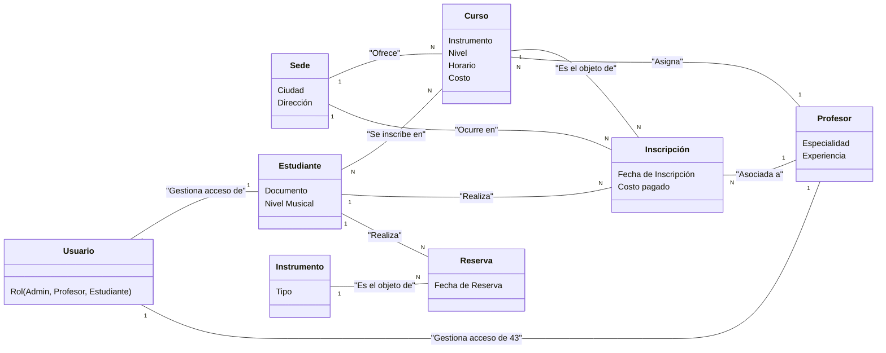
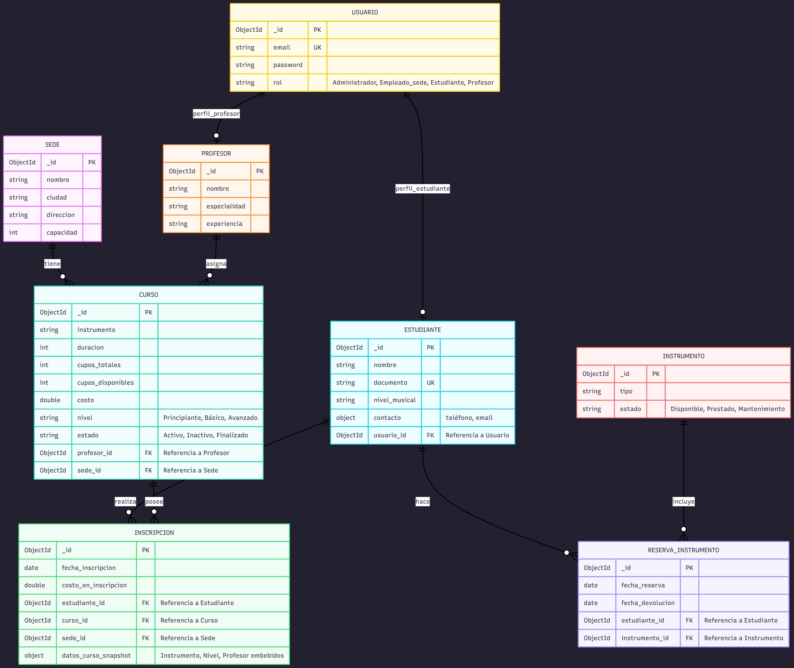

### CAMPUS MUSIC 

 
 
 
 
 
 
 

### SANTIAGO URIBE DUARTE
 

### DANIEL SANTOS FAJARDO
 
 
 

### S2

 
 

### PEDRO FELIPE GOMEZ BONILLA

 
 
 
 
 

### CAMPUSLANDS
### CAJASAN
### RUTA NODE.js
### BUCARAMANGA
### 2025
 
 
  
 
 

## Tabla de Contenido
- [Introducción](#introduccion) ............................................................................................................................. 2
- [Caso de Estudio](#casodeestudio)........................................................................................................................ 3

- [Planificación](#planificacion)............................................................................................................................... 4
    - [Modelo Conceptual](#modeloconceptual)................................................................................................... 4.1
    - [Modelo Lógico](#modelológico)............................................................................................................. 4.2

    - [Modelo Físico](#modelofisico)............................................................................................................... 4.3
        - [Justificación del uso de MongoDB](#justificacion)......................................................... 4.4.1
        - [Creacion de Indices](#indices)....................................................................................... 4.4.2
        - [Creacion de Roles y Usuarios](#roles).................................................................... 4.4.3
- [Conclusiones y Mejoras](#conclusiones)......................................................................................................... 5

 
 
 
 
 

<h1>Introducción</h1>

 
 
En este documento se presenta el desarrollo de una base de datos como solución a la situación actual de la empresa Campus Music, la cual busca mejorar su gestión de información y facilitar los procesos relacionados con su trabajo El objetivo principal es implementar una base de datos que permita un acceso más rápido, estructurado y eficiente a los datos evitando la redundancia y duplicacion de información y los errores comunes derivados del manejo manual mediante las hojas de cálculo.

Esta propuesta surge ante la necesidad de actualizar y modernizar el sistema de gestion de datos que actualmente utiliza la empresa, pasando de un manejo disperso de datos a una solución unificada y automatica. Con el uso de MongoDB, se busca aprovechar su flexibilidad y capacidad para mnejar grandes volúmenes de información en estructuras no relacionales, lo cual se aprovechara ya que sirve para un entorno donde los datos pueden variar y relacionarse de distintas formas.

A lo largo del documento se describe el proceso seguido para el desarrollo del proyecto, comenzando con el análisis del caso e identificar las principales problemáticas. Siguiendo con la explicación del diseño del modelo conceptual y lógico, que se acompaña de diagramas para representar las entidades y relaciones del sistema. Finalmente, se expone la implementación en el gestor de bases de datos MongoDB, que corresponde al modelo físico, junto con las decisiones técnicas aplicadas para garantizar la integridad, consistencia y escalabilidad de los datos.

Y asi el proyecto no solo busca ofrecer una solución funcional a los problemas actuales de Campus Music, sino también servir como una práctica de lo visto en clases.

 
 
 
 
 
 
 
 

<h1>Caso de Estudio</h1>

 
 

Se presenta el caso de Campus Music, una empresa encargada de administrar varias escuelas de música en diferentes ciudades del país. Sin embargo, sus procesos de gestión de datos, como el registro de estudiantes, docentes, cursos e inscripciones, se realizan de forma manual mediante hojas de cálculo, lo que ha generado duplicación de información, errores en los cálculos y errores en la gestión administrativa y financiera.

Ante esta situación, se propuso el desarrollo de una base de datos implementada en MongoDB como alternativa, más eficiente y organizada. Esta solución busca centralizar toda la información en un solo sistema, permitiendo un manejo más rápido, confiable y estructurado de los datos, además de reducir los errores provocados por el manejo manual.

Con la implementación de esta propuesta, Campus Music mejorará la integridad de sus registros, optimizará el acceso a la información y mejorará la gestión general de sus operaciones internas.

 
 
 
 
 
 
 

<h1>Planificación</h1>

 

<h2>Modelo Conceptual</h2>

El modelo conceptual representa de forma general cómo se relacionan los distintos elementos que hacen parte del sistema de Campus Music. Su funcion es mostrar la estructura lógica de la información sin entrar todavía en muchos detalles, como tipos de datos o validaciones. Ayuda a entender qué entidades fueron determinadas, cómo se conectan entre ellas y qué papel cumple cada una dentro del sistema.

<h3>Grafica</h3>

En este caso, el modelo está compuesto por varias entidades principales:

- **Usuario:** controla el acceso al sistema y define el rol de cada persona (administrador, profesor o estudiante).

- **Sede**: representa las escuelas de música ubicadas en diferentes ciudades, con su respectiva dirección.

- **Profesor:** contiene los datos de los docentes, junto con su especialidad y experiencia.

- **Estudiante:** almacena información personal de los alumnos, como documento y nivel musical.

- **Curso:** indica los cursos que ofrece cada sede, detallando el instrumento, nivel, horario y costo.

- **Inscripción:** relaciona a los estudiantes con los cursos y profesores, guardando la fecha y el costo pagado.

- **Instrumento:** muestra los tipos de instrumentos disponibles para préstamo o uso dentro de las sedes.

- **Reserva:** conecta a los estudiantes con los instrumentos que utilizan, registrando la fecha de la reserva.

A su vez estas entidades están relacionadas entre ellas de manera que muestran cómo interactúan dentro del sistema. 

En cuanto a la normalización se refiere, el modelo cumple con los principios hasta la tercera forma normal, ya que todos los atributos son atómicos y dependen completamente de su clave principal y no existen dependencias entre atributos que no sean clave. Esto permite evitar redundancias y asegurar que la información esté organizada de manera lógica y coherente.

 
 
 
 

<h2>Modelo Lógico</h2>

 
 

El modelo lógico es una manera más técnica de representar lala estructura del sistema y cómo la información será organizada dentro de la base de datos. Diferente del modelo conceptual, el lógico ya define los atributos, tipos de datos y relaciones entre las colecciones, lo que lo hace más cercano al diseño real que se implementará.

En el caso de este proyecto, el modelo lógico sirve para mostrar cómo se conectan las diferentes colecciones de MongoDB como Usuarios, Profesores, Estudiantes, Sedes, Cursos, Inscripciones, Instrumentos y Reservas de Instrumentos.
Cada una tiene sus propios campos y referencias, mostrando qué datos se guardan, qué claves se relacionan entre sí y cómo se mantiene la integridad entre los registros.

Por ejemplo, los estudiantes están vinculados a un usuario para su acceso, las inscripciones conectan estudiantes con cursos y profesores, y las reservas relacionan instrumentos con los alumnos que los utilizan.

Este modelo nos permite visualizar de forma clara cómo fluirá la información y comprobar que el diseño que hemos planteado cumple con las reglas de consistencia y normalización necesarias.

 

<h3>Grafica</h3>

 

 
 
 
 
 

<h2>Modelo Fisico</h2>

<h3>Jusitificación del Uso de MongoDB </h3>

Elegimos MongoDB porque:

- Permite modelos en documentos (JSON) que encajan bien con entidades que cambian de estructura (ej. distintos campos para cursos, instrumentos, perfiles).

- Facilidad para integrar con JavaScript/Node.js (mis scripts y tests están en JS).

- Soporta transacciones multi-documento (necesarias para inscripciones que afectan varias colecciones).

- Buen rendimiento para consultas agregadas y flexibles (agg framework), útil para reportes de ocupación, cursos demandados, etc.

MongoDB nos brinda flexibilidad, rapidez de desarrollo y soporta las garantías necesarias para la lógica de negocio (transacciones y validaciones). Ademas el cliente solicito este Gestor.

<h3>Creacion de Indices</h3>

Los índices se definieron sobre los campos de consulta más frecuentes.

#### Estudiantes
- Índice único: `{ documento: 1 }` para impedir documentos repetidos.

#### Profesores
- Índice único: `{ correo: 1 }` para evitar correos duplicados.
- Índice de texto: `{ nombre: "text" }` para búsquedas por nombre.

#### Sedes
- Índice compuesto único: `{ ciudad: 1, direccion: 1 }` para no duplicar direcciones en una misma ciudad.

#### Cursos
- Índice por sede: `{ sedeId: 1 }` para filtrar cursos por sede.

#### Inscripciones
- Índice compuesto: `{ estudianteId: 1, cursoId: 1 }` para relación estudiante–curso y deduplicación lógica.

#### Instrumentos
- Índice compuesto único: `{ sedeId: 1, codigoInventario: 1 }` para asegurar unicidad del inventario por sede.

#### Reservas de instrumentos
- Índice compuesto: `{ estudianteId: 1, instrumentoId: 1 }` para verificar reservas por estudiante e instrumento.

---

<h3>Creacion de Roles y Usuarios</h3>

Se definieron tres roles con alcance en la base de datos de la app (mismo `db.getName()`).

#### Rol administrador (`rol_admin_app`)
- Acciones: `find`, `insert`, `update`, `remove`, `createCollection`, `createIndex`, `dropCollection`.
- Uso: administración total y mantenimiento.

#### Rol analista (`rol_analista`)
- Acciones: `find`, `collStats`, `dbStats`.
- Uso: lectura y estadísticas (BI/reportes).

#### Rol lector (`rol_lector`)
- Acciones: `find`.
- Uso: solo lectura (consultas básicas).

#### Usuarios creados

| Usuario         | Rol asignado       | Permisos principales                                          |
|-----------------|--------------------|---------------------------------------------------------------|
| admin_user      | rolAdministrador   | Control total sobre todas las colecciones de la base de datos |
| empleado_bogota | rolEmpleadoSede    | Puede consultar y registrar inscripciones o reservas          |
| estudiante_e01  | rolEstudiante      | Puede consultar cursos y crear reservas personales            |

---

<h3>Conclusiones y Mejoras</h3>

- MongoDB funcionó bien porque no fue necesario definir todo desde el inicio.  
- Los validadores `$jsonSchema` mantuvieron consistencia de tipos y formatos (especialmente correos y fechas).  
- Los índices aceleran consultas comunes (documento, correo, relaciones por id).  
- Los roles simplifican controlar quién puede leer o modificar.

**Mejoras posibles:**
- Automatizar inserciones y referencias para no usar `ObjectId()` “vacíos”.
- Implementar control de acceso por sede a nivel de aplicación.

- Agregar auditoría (colección audit_logs) para trazabilidad de cambios.

- Automatizar tests para las agregaciones críticas.

- Añadir monitorización/alertas por cupos críticos o inconsistencias.

